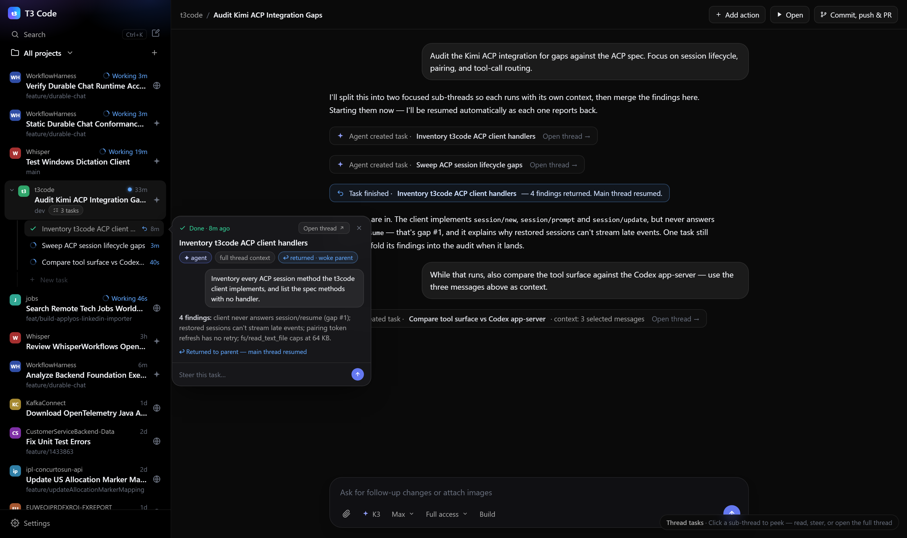

# Thread tasks (sub-threads) — mockup handoff

Static HTML mockup of the chosen UX for **tasks inside a thread** in T3 Code. This is the input
for planning and refinement — not an implementation.

A **task** is a sub-thread: a real thread owned by a parent thread, created by the main thread's
agent or manually by the user, with its own prompt and context. When a task finishes, t3code
**wakes the parent thread** with the task's results so it can continue working.

## Files

- `index.html` — the mockup. Open directly in a browser (works over `file://`, no server needed).
  `?peek=t1|t2|t3` auto-opens that task's mini window (deep links, screenshots).
- `mockup.css` — app-chrome styles approximating the `apps/web` dark theme (sidebar v2 tokens).
- `mockup.png` — screenshot of the current state (mini window open on the finished task).
- `HANDOFF.md` — this file.

## The design to replicate

Only the sidebar thread row changes structurally; everything else is additive.

**Sidebar**

1. A thread can own sub-threads. Parent row gains: disclosure chevron (collapse/expand), a
   `N tasks` count chip next to the branch, and a **blue dot** meaning "a task returned results
   and resumed this thread" (unread-results indicator).
2. Sub-thread rows are indented under the parent with a guide line. Each row: status icon
   (spinner = running, blue; check = done, green; ↩ marker on tasks that returned results),
   title, elapsed time.
3. A `+ New task` row at the end of the group (hover-visible) is the manual creation entry point.

**Mini thread window** (click a sub-thread row)

4. Floating glass card anchored to the row with a caret. The clicked row stays highlighted.
   Closes on Esc, outside click, or when the group is collapsed.
5. Anatomy, top to bottom:
   - status line (`Working · 3m` / `Done · 8m ago`) + **Open thread ↗** button + close X
   - title
   - chips: creator (`✦ agent` / `you`), context (`full thread context` / `3 selected messages`),
     model (`K3 · Max`), and on finished tasks `↩ returned · woke parent`
   - mini timeline: the task's prompt as a user bubble, its latest activity as assistant text,
     and on finished tasks an event line `↩ Returned to parent — main thread resumed`
   - `Steer this task…` composer with a send button — message the sub-thread without navigating
6. **Open thread ↗** navigates to the sub-thread as a normal full thread view.

**Parent thread timeline**

7. Task lifecycle appears as quiet event rows in the conversation:
   - `Agent created task · <title>`
   - `You created task · <title> · context: 3 selected messages`
   - wake-up row (info-blue tinted): `Task finished · <title> — N findings returned. Main thread resumed.`

## Scenario captured in the mockup

Parent thread: _Audit Kimi ACP Integration Gaps_ (project `t3code`, branch `dev`). Three tasks:

- **t1** — agent-created, _done_ 8m ago: 4 findings returned, parent was woken (shown open in `mockup.png`)
- **t2** — agent-created, _running_: full thread context
- **t3** — created manually by the user, _running_: 3 selected messages as context

## Semantics to carry into implementation

- Tasks are full threads (own session/provider), linked by a `parentThreadId`.
- Context options at creation: full thread / selected messages / none.
- Completion delivers a result event to the parent and **resumes (wakes) it**, even if the user
  is looking at another thread — the parent's blue dot is the unread marker for that.
- Steering from the mini window posts a message to the sub-thread without navigation.
- Sub-threads otherwise behave like normal threads: openable, listed, settleable.

## Open questions for planning

- **Data model**: where `parentThreadId` lives (contracts/session types), persistence, and what
  happens to running children when the parent settles or is archived.
- **Wake-up mechanics**: how results are injected into the parent (synthetic user message vs.
  system event), and how the parent is resumed if its provider session is idle or stopped.
- **Agent surface**: the tool/API the agent calls to create a task (title, prompt, context spec)
  and how the UI learns about it (event in `packages/contracts`).
- **Manual creation** beyond the sidebar row: composer mode? message selection → "create task
  with this context"?
- **Sidebar behavior**: nesting depth (1 level only?), where settled tasks go, mobile layout.
- **Mini window**: does it stream live activity? Is the steer composer plain text or the full
  composer feature set?
- **Likely touchpoints to investigate**: `apps/web` sidebar thread list, thread timeline, and
  composer; `apps/server` session/provider management; `packages/contracts` session and event
  schemas.
